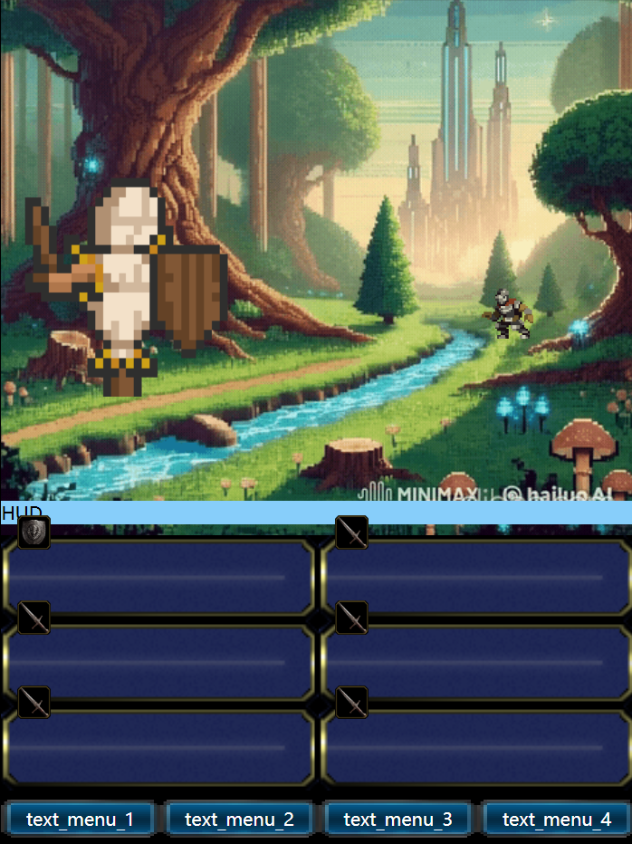

# Fantasy fight Simulator

## preview

## [try it](https://gamercraf2001.github.io/Fantasy-fight-Simulator/)

## overview:

This is a rough proof of concept, using a html app to build retro JRPG battle scene, including a mobile-friendly interface, gesture control, state switch function, attack animations, dynamic background, BGM and sound.

You can rewrite script to replace different background and sprites. 

Respect knowledge copyright and enjoy.

## roadmap:

I have some crazy plan for features.

However, I'm not a good web programer, achieving them will take a lot of time and a lot of learning.
Very possible, I'll get frustrated in the middle and abandon this project. 
So please don't expect too much.

- [❌] Refactor the project using some of mature framework.
- [❌] PWA
- [❌] Multi-language support
- [❌] Standardized animation playback logic, Image frame Sequence and GIF support.
- [❌] Vector UI, skill system, settings, local storage.
- [❌] Import 2D sprite, UI assets, sound or preset from JSON/URL link.
- [❌] Complete battle logic and damage calculation.
- [❌] AI system
- [❌] Map Exploration
- [❌] Level Selector
- [❌] Level generation by Generative AI
- [❌] Anything else, you can suggest.

## assets

- favicon icon:

    - [bing images create](https://www.bing.com/images/create) 

- background

    - [chatgpt](https://chatgpt.com/)

    - [HailuoAI](https://hailuoai.video/)

- attack, item, skill icon

    - [bing images create](https://www.bing.com/images/create) 

- limit icon

    - [bing images create](https://www.bing.com/images/create) 

    - [Skill, item and spell icons - pauliuw](https://opengameart.org/content/skill-item-and-spell-icons)(CC0)

- magic

    - bing

    - [Skill, item and spell icons - pauliuw](https://opengameart.org/content/skill-item-and-spell-icons)(CC0)

- summon
    - [Skill, item and spell icons - pauliuw](https://opengameart.org/content/skill-item-and-spell-icons)(CC0)
    - [Fire - janexx](https://opengameart.org/content/fire)(CC-BY-SA 3.0)

- bgm

    - [16-Bit Starter Pack - Bit By Bit Sound](https://bit-by-bit-sound.itch.io/16-bit-starter-pack)

- sound effect

    - [rpg sound pack-artisticdude](https://opengameart.org/content/rpg-sound-pack)(CC0)

- enemy

    - [2d Pixel Art Training Dummy Sprites - Elthen‘s Pixel Art Shop](https://elthen.itch.io/2d-pixel-art-training-dummy)

- unit

    - [Fantasy Knight - Free Pixelart Animated Character - Namatnieks](https://aamatniekss.itch.io/fantasy-knight-free-pixelart-animated-character)

- picture edited by [photopea](https://www.photopea.com/)
